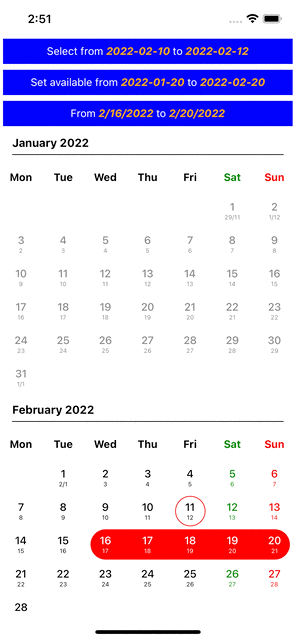

# react-native-calendar-list-picker

## React Native Calendar List Picker Components

## Installation

```sh
npm install react-native-calendar-list-picker
```
or
```sh
yarn add react-native-calendar-list-picker
```

## Usage

```js
import { CalendarList } from "react-native-calendar-list-picker";

// ...

const MyExample = () => {
  return (
    <CalendarList
      modePress="multiple"
      fullDateRange={[new Date('2022-01-01'), new Date('2022-03-31')]}
      availableDateRange={[new Date('2022-02-01'), new Date('2022-03-31')]}
      startDate={new Date('2022-02-16')}
      endDate={new Date('2022-02-20')}
      onSelectionDate={(
        startDate: Date | undefined,
        endDate: Date | undefined
      ) => {
        console.log('startDate: ', startDate, 'endDate: ', endDate);
      }}
    />
  );
};
```

## Screenshots



## Contributing

See the [contributing guide](CONTRIBUTING.md) to learn how to contribute to the repository and the development workflow.

## License

MIT
